# Aarambh LMS - Database Relationship Diagram

## Complete Database Architecture

```mermaid
graph TB
    subgraph Users
        Admin[👨‍💼 Admin<br/>System Management]
        Teacher[👩‍🏫 Teacher<br/>Course Instructor]
        Student[👨‍🎓 Student<br/>Learner]
    end
    
    subgraph Course_Content
        Course[📚 Course<br/>Content & Modules]
        Assignment[📝 Assignment<br/>Tasks & Deadlines]
        Discussion[💬 Discussion<br/>Forum & Q&A]
    end
    
    subgraph Student_Work
        Submission[📄 Submission<br/>Student Work]
        Grade[📊 Grade<br/>Final Scores]
        Attendance[✅ Attendance<br/>Presence Tracking]
    end
    
    subgraph Communication
        Notification[🔔 Notification<br/>User Alerts]
        Announcement[📢 Announcement<br/>System Messages]
    end
    
    Teacher -->|creates| Course
    Teacher -->|creates| Assignment
    Teacher -->|grades| Submission
    Teacher -->|marks| Attendance
    Teacher -->|posts| Announcement
    Teacher -->|manages| Discussion
    Teacher -->|calculates| Grade
    
    Student -->|enrolls in| Course
    Student -->|submits| Submission
    Student -->|participates in| Discussion
    Student -->|receives| Notification
    Student -->|has| Attendance
    Student -->|has| Grade
    
    Admin -->|oversees| Course
    Admin -->|sends| Announcement
    Admin -->|manages| Users
    
    Course -->|has| Assignment
    Course -->|has| Discussion
    Course -->|tracks| Attendance
    Course -->|generates| Grade
    Course -->|sends| Notification
    
    Assignment -->|receives| Submission
    Assignment -->|contributes to| Grade
    Assignment -->|triggers| Notification
    
    Submission -->|updates| Grade
    Submission -->|creates| Notification
    
    Discussion -->|sends| Notification
    
    Announcement -->|creates| Notification
```



## Collection Relationships

### User → Course
- **Teacher**: `User.teachingCourses[]` → `Course._id`
- **Student**: `User.enrolledCourses[]` → `Course._id`
- **Course**: `Course.teacher` → `User._id` (teacher)
- **Course**: `Course.enrolledStudents[]` → `User._id` (students)

### Course → Assignments
- **Assignment**: `Assignment.course` → `Course._id`
- **Assignment**: `Assignment.teacher` → `User._id`

### Assignment → Submissions
- **Submission**: `Submission.assignment` → `Assignment._id`
- **Submission**: `Submission.student` → `User._id`
- **Submission**: `Submission.course` → `Course._id`
- **Submission**: `Submission.gradedBy` → `User._id`

### Course → Discussions
- **Discussion**: `Discussion.course` → `Course._id`
- **Discussion**: `Discussion.author` → `User._id`
- **Discussion**: `Discussion.replies[].author` → `User._id`

### Course → Grades
- **Grade**: `Grade.student` → `User._id`
- **Grade**: `Grade.course` → `Course._id`
- **Grade**: `Grade.teacher` → `User._id`
- **Grade**: `Grade.assignments[].assignment` → `Assignment._id`

### Course → Attendance
- **Attendance**: `Attendance.course` → `Course._id`
- **Attendance**: `Attendance.student` → `User._id`
- **Attendance**: `Attendance.teacher` → `User._id`

### User → Notifications
- **Notification**: `Notification.recipient` → `User._id`
- **Notification**: `Notification.sender` → `User._id`
- **Notification**: `Notification.relatedCourse` → `Course._id`
- **Notification**: `Notification.relatedAssignment` → `Assignment._id`
- **Notification**: `Notification.relatedDiscussion` → `Discussion._id`

### Admin → Announcements
- **Announcement**: `Announcement.author` → `User._id`
- **Announcement**: `Announcement.course` → `Course._id` (if course-specific)
- **Announcement**: `Announcement.readBy[]` → `User._id`

## Data Flow Examples

### Student Enrollment Flow
```
1. Student → enrolls → Course
2. Course.enrolledStudents[] ← Student._id
3. Student.enrolledCourses[] ← Course._id
4. Notification created → Student
```

### Assignment Submission Flow
```
1. Teacher → creates → Assignment
2. Student → submits → Submission
3. Submission.assignment → Assignment._id
4. Submission.student → Student._id
5. Notification created → Teacher
6. Teacher → grades → Submission
7. Submission.score updated
8. Grade.assignments[] updated
9. Notification created → Student
```

### Attendance Marking Flow
```
1. Teacher → marks → Attendance
2. Attendance.course → Course._id
3. Attendance.student → Student._id
4. Attendance.status → 'present'/'absent'/'late'/'excused'
```

### Grade Calculation Flow
```
1. Grade aggregates:
   - Assignment scores (weighted)
   - Midterm score (25%)
   - Final exam score (35%)
   - Participation score (10%)
2. Calculate total score
3. Determine letter grade
4. Calculate GPA points
5. Update Grade record
6. Notification created → Student
```

## Indexes for Performance

### Users Collection
```javascript
{ email: 1 }           // Unique - for login
{ role: 1 }            // For filtering by user type
```

### Courses Collection
```javascript
{ teacher: 1 }         // For teacher's courses
{ isPublished: 1 }     // For published courses
{ name: 'text', description: 'text' }  // For search
```

### Assignments Collection
```javascript
{ course: 1, dueDate: 1 }  // For course assignments by date
```

### Submissions Collection
```javascript
{ assignment: 1, student: 1 }  // For student's submission
{ course: 1, status: 1 }        // For grading workflow
```

### Discussions Collection
```javascript
{ course: 1 }  // For course discussions
```

### Notifications Collection
```javascript
{ recipient: 1, isRead: 1, createdAt: -1 }  // For user's notifications
```

### Attendance Collection
```javascript
{ course: 1, student: 1, date: -1 }  // For attendance history
{ student: 1, status: 1 }            // For attendance stats
```

### Grades Collection
```javascript
{ student: 1, course: 1 }  // Unique - one grade per student per course
{ course: 1, status: 1 }   // For course grade reports
```

### Announcements Collection
```javascript
{ targetAudience: 1, isPinned: -1, publishDate: -1 }  // For listing
{ course: 1, isPublished: 1 }                          // For course announcements
```

## Query Patterns

### Get Student's Dashboard Data
```javascript
// 1. Get student's enrolled courses
const courses = await Course.find({ 
  enrolledStudents: studentId 
}).populate('teacher');

// 2. Get upcoming assignments
const assignments = await Assignment.find({
  course: { $in: studentCourseIds },
  dueDate: { $gte: new Date() }
}).sort({ dueDate: 1 });

// 3. Get unread notifications
const notifications = await Notification.find({
  recipient: studentId,
  isRead: false
}).sort({ createdAt: -1 });

// 4. Get latest announcements
const announcements = await Announcement.find({
  $or: [
    { targetAudience: 'all' },
    { targetAudience: 'students' },
    { course: { $in: studentCourseIds } }
  ],
  isPublished: true
}).sort({ isPinned: -1, publishDate: -1 });
```

### Get Teacher's Dashboard Data
```javascript
// 1. Get teacher's courses
const courses = await Course.find({ 
  teacher: teacherId 
});

// 2. Get pending submissions
const submissions = await Submission.find({
  course: { $in: teacherCourseIds },
  status: 'submitted'
}).populate('student assignment');

// 3. Get recent discussions
const discussions = await Discussion.find({
  course: { $in: teacherCourseIds }
}).sort({ createdAt: -1 }).limit(10);
```

### Get Course Analytics
```javascript
// 1. Enrollment stats
const enrollmentCount = course.enrolledStudents.length;

// 2. Average attendance
const avgAttendance = await Attendance.aggregate([
  { $match: { course: courseId } },
  { $group: {
    _id: '$student',
    totalSessions: { $sum: 1 },
    presentCount: {
      $sum: {
        $cond: [{ $in: ['$status', ['present', 'late']] }, 1, 0]
      }
    }
  }},
  { $project: {
    percentage: { 
      $multiply: [{ $divide: ['$presentCount', '$totalSessions'] }, 100] 
    }
  }}
]);

// 3. Average grade
const avgGrade = await Grade.aggregate([
  { $match: { course: courseId, status: 'completed' } },
  { $group: {
    _id: null,
    averageScore: { $avg: '$totalScore' }
  }}
]);

// 4. Assignment completion rate
const completionRate = await Submission.aggregate([
  { $match: { course: courseId } },
  { $group: {
    _id: '$assignment',
    submissionCount: { $sum: 1 }
  }},
  { $lookup: {
    from: 'assignments',
    localField: '_id',
    foreignField: '_id',
    as: 'assignment'
  }}
]);
```

## Cascade Delete Rules

When deleting entities, handle related data:

### Delete User
```javascript
// If Student:
- Remove from Course.enrolledStudents[]
- Delete/archive Submissions
- Delete/archive Grades
- Delete/archive Attendance
- Delete Notifications (as recipient)

// If Teacher:
- Archive or reassign Courses
- Archive Assignments
- Archive Grades
- Update Submissions.gradedBy

// If Admin:
- Transfer ownership of Announcements
```

### Delete Course
```javascript
- Delete Assignments
- Delete Submissions
- Delete Discussions
- Delete Grades
- Delete Attendance records
- Delete course-specific Announcements
- Remove from User.enrolledCourses[]
- Remove from User.teachingCourses[]
- Delete related Notifications
```

### Delete Assignment
```javascript
- Delete Submissions
- Remove from Grade.assignments[]
- Delete related Notifications
```

---

## Best Practices

1. **Always use transactions** for operations affecting multiple collections
2. **Populate sparingly** - only fetch needed fields
3. **Use pagination** for large datasets (courses, students, submissions)
4. **Cache frequently accessed data** (course lists, user profiles)
5. **Archive old data** instead of deleting (submissions, grades)
6. **Implement soft deletes** for important records
7. **Monitor slow queries** through MongoDB Atlas
8. **Regular backups** - automated through Atlas

---

This diagram shows how all 9 collections work together in your Aarambh LMS! 🎓
